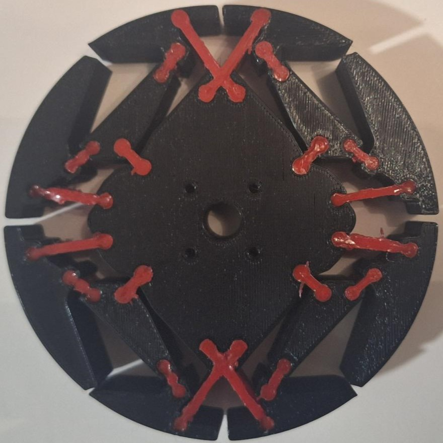
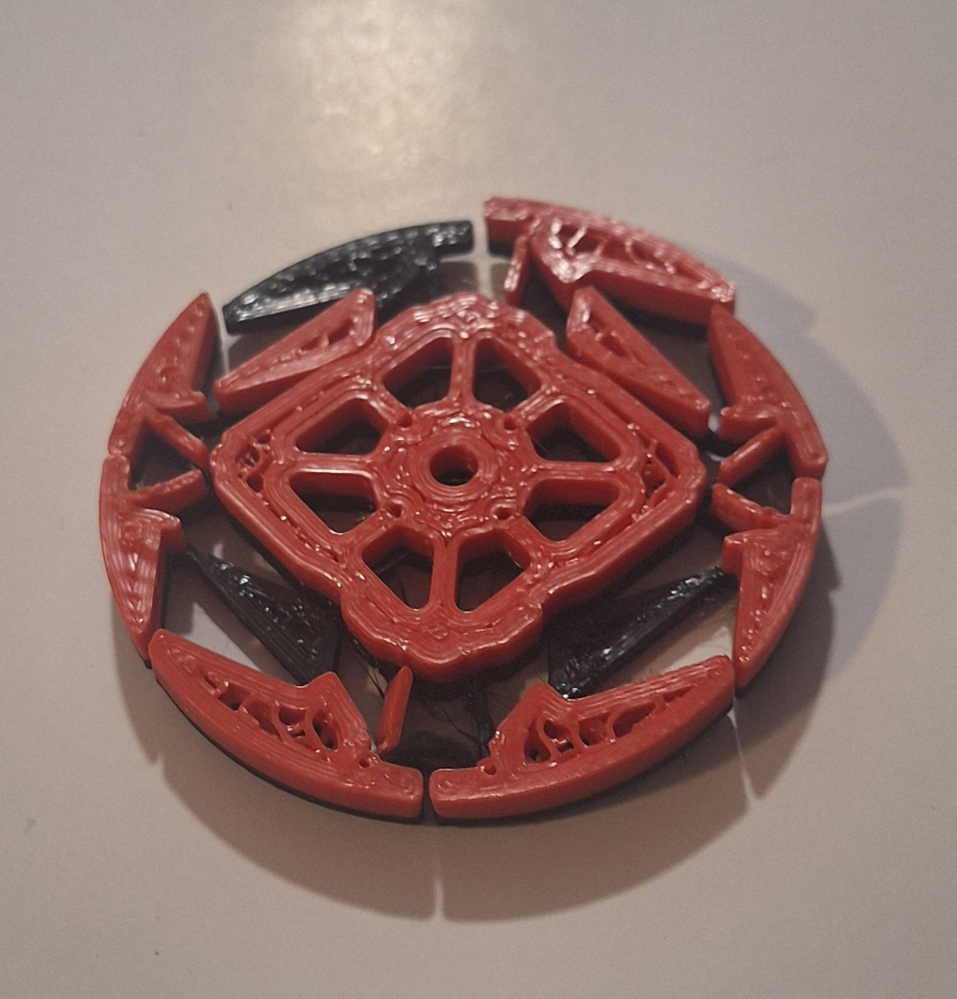
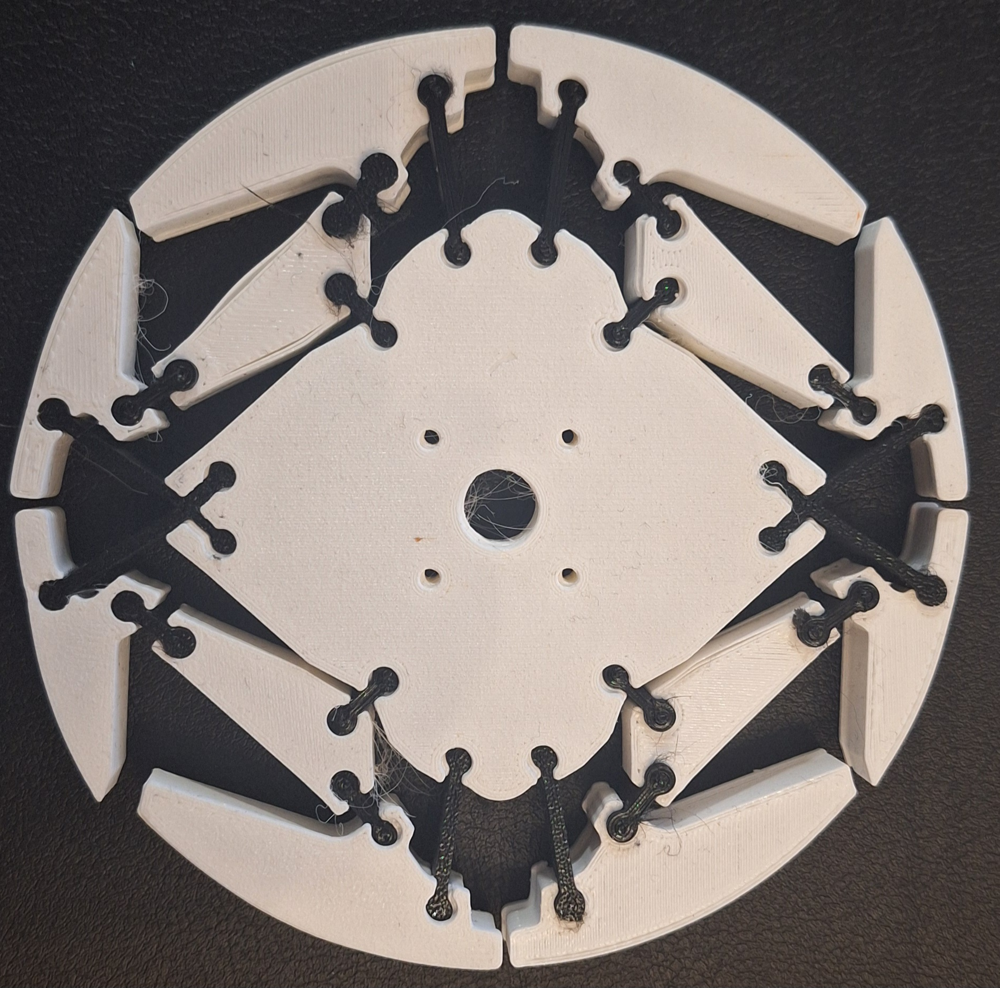

# Analysis-of-Adaptive-Passive-Technologies-for-the-Robot-Traversal-in-Unstructured-Environments

Repo containing the suplimentary file for the publication, 'Analysis of Adaptive Passive Technologies for the Robot Traversal in Unstructured Environments' at TAROS 2025.

Inside this repo you can find the 3D files for the release of the DogBone Wheel and addition details regarding the Testing Platform and other details.

**More detail will be added to this repo over the next month detailing more of the process and findings**

```bibtex
@InProceedings{Stevenson2025AdaptivePassive,
author="Stevenson, Robert Liam
and Klimchik, Alexandr",
editor="Cavalcanti, Ana
and Foster, Simon
and Richardson, Robert",
title="Analysis of Adaptive Passive Technologies for the Robot Traversal in Unstructured Environments",
booktitle="Towards Autonomous Robotic Systems",
year="2026",
publisher="Springer Nature Switzerland",
address="Cham",
pages="152--164",
isbn="978-3-032-01486-3"
}
```

---

## DogBone Wheel



The DogBone wheel's materials used in this work consisted of Ninjaflex TPU, with a 85A shore hardness (the red "bones" in the image above), and PLA for the more structural parts (such as the "claws" and "pads").

### Print Parameters

#### "Bones (NinjaFlex TPU)"

- 0.5mm nozzle
  - *printed on Luzbot Taz Mini 2*
- 100% infill
- 0.2mm layer height

#### "Claw and Pads (PLA)"

- 0.4mm nozzle
  - *printed on a range of machine: Prusa Mini+, Prusa MK3s, and Creality Ender 5, Sovol SV06*
- 15% grid infill
  - *for future printing I would recommend a higher infill percentage (ie. 20-25%) and use an infill pattern such as Gyroid, Cross Hatach or 3D Cubic/Honeycomb for additional strength*
- 0.2mm layer height

## Developement Process



Through early experimentation, a hybrid material manufacturing method was attempted before however with challengdges due to material swapping and equipment we looked at approaches alternative.



From this we came about the idea of breaking the single-part nature of the [PaTS-Wheel](https://ieeexplore.ieee.org/document/10502024) that the DogBone-Wheel is based on and intruse the idea of "bones" for the flexible component. 
A proof-of-concept prototype using 95A TPU bone for a half thickness wheel was made to ensure the Flexure behaviour remanded in our modification.


It's from here that the DogBone wheel was made using Ninjaflex TPU, with a 85A shore hardness, for the red "bones" in the image above, and PLA for the more structural parts (such as the "claws" and "pads").


A Standard wheel was also printed to serve as our baseline wheel config for comparision regarding the vibration and energy consumption characteristics.

## The TLDR of the Findings

From our results, we can boil the findings down to the core points of:​

- Standard wheel: Energy efficient but obstacle-limited​

- PaTS-Wheel: Consistent performance, debris vulnerability​, minor energy ineffiecency over the standard wheel design.

- DogBone: Great for research, not ready for deployment in it’s current tested config​, expect higher energy ineffiencies with the current tested configuration. 

It is important that the choice of wheel is made with consideration to the intended/expected operating environment and the acceptable mobiliy and energy efficency requirements.

---

## Acknowledgment

This work was supported by the Engineering and Physical Sciences Research Council and AgriFoRwArdS CDT [EP/S023917/1].
